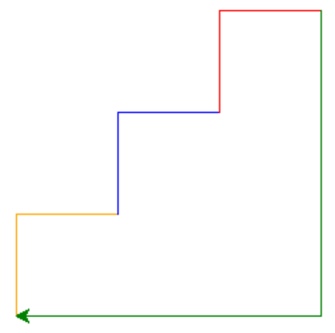

# Soal Tutorial  

## Pertarungan #1
### Turtle

Benny dan Ibnu merupakan mahasiswa baru Fasilkom UI, setelah mempelajari cara
penggunaan IDLE, cara membuat program sederhana, dan cara menggambar dengan
Turtle, kini Benny dan Ibnu dapat menulis program untuk membuat bentuk segitiga
dengan turtle.

#### Contoh program:

```python
import turtle

# Instansiasi objek turtle
kura = turtle.Turtle()

# Mengaktifkan pena
kura.pendown()

# Memakai tinta biru
kura.color('blue')

# Bergerak maju sejauh 100 satuan
kura.forward(100)

# Memutar ke arah kiri sebesar 120 derajat
kura.left(120)

kura.forward(100) kura.left(120) kura.forward(100)

# Menon-aktifkan pena
kura.penup()

# Menutup turtle setelah di-click
turtle.exitonclick()
```

Benny, sebagai sesama mahasiswa baru, tidak ingin kalah dengan Ibnu. Ia pun
berniat membuat bentuk yang lebih rumit dari Ibnu, yaitu bentuk anak tangga.
Sebagai mahasiswa Fasilkom UI yang baik hati dan tidak sombong, bantulah
keinginan Benny!

-   Buatlah program seperti contoh program di atas, tetapi sekarang dengan
    bentuk tangga dengan tiga anak tangga yang tertutup!
-   Coba mintalah input dari user untuk digunakan sebagai panjang dari sisi
    tangga tersebut.
-   Aturan pewarnaan tangga disesuaikan dengan contoh output yang dilampirkan.

#### Contoh masukan:

> Masukkan panjang setiap anak tangga: **75**

#### Contoh keluaran:


---

## Pertarungan #2
### Tipe Data

Benny merupakan seorang anak yang rajin, selalu ingin tahu dan senang membantu.
Suatu ketika, Kakak dari Benny yaitu Hamish, akan melangsungkan pernikahan.
Hamish memiliki pekerjaan sebagai aktor yang dibayar sebesar Rp.500.000 per
harinya. Karena biaya resepsi pernikahan mahal, tentunya akan membutuhkan waktu
yang lama untuk dapat memenuhinya. Mengetahui Anda sedang belajar Dasar-Dasar
Pemrograman, Benny memiliki ide untuk membantu kakaknya dengan meminta Anda
membuat sebuah program untuk memprediksi lama waktu yang dibutuhkan untuk dapat
memenuhi biaya pernikahan tersebut.

#### Asumsikan:
- 1 tahun = 12 bulan
- 1 bulan = 4 minggu
- 1 minggu = 7 hari

#### Format masukan
Masukan berupa biaya pernikahan. Biaya pernikahan dijamin habis dibagi
Rp500.000 dan merupakan bilangan non-negatif.  

#### Format keluaran
Keluaran berupa hasil prediksi waktu untuk dapat memenuhi biaya pernikahan dan
harus dalam format:
> Anda harus bekerja selama **x** tahun **y** bulan **z** minggu **a** hari
untuk memenuhi biaya pernikahan.  

**x**, **y**, **z**, dan a adalah elemen bilangan bulat non-negatif yang
merupakan hasil prediksi waktu tahun, bulan, minggu, dan hari secara urut
serta:
-   x >= 0,
-   0 <= y < 12,
-   0 <= z < 4,
-   0 <= a < 7

#### Contoh masukan 1 (masukan adalah bagian yang di-bold):
> Masukkan biaya pernikahan: Rp **964000000**

Hint: `print()` akan selalu membuat kursor ke newline (baris baru), supaya
kursor tidak ke baris baru, gunakan:
`print(sesuatu, end="")`

#### Contoh keluaran 1:
> Anda harus bekerja selama 5 tahun 8 bulan 3 minggu 3 hari untuk memenuhi
biaya pernikahan.

#### Contoh masukan 2:
> Masukkan biaya pernikahan: Rp **168000000**

#### Contoh keluaran 2:

> Anda harus bekerja selama 0 tahun 12 bulan 0 minggu 0 hari untuk memenuhi
biaya pernikahan. **(SALAH)**

> Anda harus bekerja selama 1 tahun 0 bulan 0 minggu 0 hari untuk memenuhi
biaya pernikahan. **(BENAR)**

SELAMAT MENGERJAKAN DAN HAPPY CODING 😊

**AA - END - KT - ZZ**

---

Diambil dari `DDP1_KelasBD_Lab01_7Sep2017.pdf` (Tutorial Lab 1 DDP1 B dan D --
07 September 2017)
