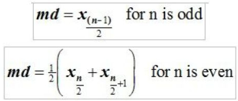

# Soal Tutorial

## PR Matematika

Suatu hari yang cerah di kehidupan tanpa tugas di Fasilkom, Cenna
sedang tidur-tiduran di perpus. Tiba-tiba temannya, Wisesa dari fakultas
MIPA menelpon Cenna dan meminta bantuannya. Ia mendapatkan PR
matematika mengenai statistika, namun ia belum paham dan terlalu malas
untuk belajar. Cenna pun yang juga sedang malas, merasa tak enak jika
tidak membantu temannya. Maka Cenna meminta anda yang **rajin** sebagai
mahasiswa yang mengambil mata kuliah DDP1 untuk membantunya
membuat program demi membantu Wisesa yang malas mengerjakan
soal-soal sulit matematika. Program yang akan kalian buat, akan menerima
sebuah list yang berisi angka-angka dalam sebuah file yang akan dimasukan
Wisesa nanti, lalu program kalian akan mengeluarkan outputnya pada
sebuah file lain.

#### Format input:  

Input merupakan sebuah file dengan format nama “input.txt” (tanpa tanda
petik). File tersebut berada pada directory yang sama dengan file program
kalian.

Di dalam file tersebut berisi:
- Baris pertama berisi barisan bilangan yang menyatakan list input
-  Baris kedua berisi input Q yang menyatakan banyak operasi.
- Q baris selanjutnya menyatakan operasi-operasi yang akan dilakukan.
- Terdapat 5 operasi, yaitu:

    1. **Minimum (Min)**\
       Mencari nilai terkecil pada list.
    2. **Maksimum (Max)**\
       Mencari nilai terbesar pada list.
    3. **Median (Median)**\
       Mencari nilai tengah pada list. Rumus median:
       
    4. **Rata - rata (Mean)**\
       Mencari nilai rata-rata dari sebuah list.
    5. **Variasi (Variance)**\
       Mencari variasi dari sebuah list. Rumus varian :
       

Buatlah 5 buah fungsi yang memiliki parameter list yang di input yang akan
menerapkan operasi diatas.

#### Format output

Output akan berupa sebuah file dengan nama “output.txt” (tanpa tanda
petik) yang berada pada directory yang sama dengan program kalian.
Format untuk operasi yang ada:
- Min
    > Nilai minimum adalah **X**

- Max
    > Nilai maksimum adalah **X**

- Median
    > Nilai median adalah **X**

- Mean
    > Nilai rata-rata adalah **X**
    
    Nilai **X** merupakan bilangan decimal dengan 2 angka dibelakang
    titik(.)

- Variasi
    > Nilai varian adalah **X**

    Nilai **X** merupakan bilangan decimal dengan 2 angka dibelakang
    titik(.)

- Jika operasi yang dimasukan tidak sesuai
    > Operasi **nama_operasi** tidak ada

Nilai **X** diatas merupakan hasil perhitungan program. Semua keluaran di
cetak pada file “output.txt”.

#### Contoh input (pada file input.txt)
> 1 2 10 7 5 22 3\
> 5\
> Max\
> Median\
> Mean\
> Varian\
> Sulit

#### Contoh output (pada file output.txt)
> Nilai maksimum adalah 22\
> Nilai median adalah 5\
> Nilai rata-rata adalah 7.14\
> Nilai variasi adalah 52.48\
> Operasi Sulit tidak ada

“<i>Hasil kerja keras kalian sangat kami apresiasi dibandingkan hasil yang kalian
copy dari orang lain</i>”

 

<strong>SELAMAT MENGERJAKAN
DAN HAPPY CODING 😊</strong>

 

**PKF - HFZ - RCJ - WR**

---

Diambil dari `Soal Tutorial Lab 6 - Kelas A.pdf` (Tutorial Lab 6 DDP1 A
\-- 4 Oktober 2017)