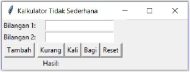

# Soal Tutorial

## Kalkulator Tidak Sederhana

Suatu hari Ibu sedang ingin menghitung barang dagangan yang sudah
dibeli, namun kalkulatornya sedang hilang. Kemudian dengan antusias,
kamu sebagai salah satu mahasiswa yang sedang menjalani mata kuliah
DDP1 dan anak yang berbakti pada orang tua, ingin mengaplikasikan ilmu
*ngoding*-mu dengan membuatkan sebuah kalkulator untuknya. Namun Ibu
tidak mengerti jika tampilan program kalian sulit dimengerti dan tidak
estetik. Maka program kalkulator tersebut perlu dibungkus dengan GUI.

Berikut ini salah satu contoh tampilan GUI dari program kalkulator **paling
sederhana.** Mahasiswa dipersilahkan dan dianjurkan untuk berkreasi
se-kreatif maupun se-rapi mungkin, jika ingin menghias atau menampilkan
wujud program dalam tampilan yang lebih menarik (bonus).

#### Penjelasan:
- Button Tambah untuk menjumlahkan input bilangan 1 dan bilangan 2
- Button Kurang untuk mengurangkan input bilangan 1 dengan bilangan 2
- Button Kali untuk mengalikan bilangan 1 dengan bilangan 2
- Button Bagi untuk membagi bilangan 1 dengan bilangan 2
- Button Reset untuk menghapus input dalam bilangan 1, bilangan 2 dan
  hasil
- Di sebelah Label Hasil akan ditampilkan output dari operasi yang
dilakukan

#### NOTE:
- Jangan lupa untuk menghandle semua case yang anda anggap salah
  atau error dalam sebuah program kalkulator.
- Kerapian dan keindahan GUI anda juga masuk dalam penilaian asisten

 

<strong>SELAMAT MENGERJAKAN
DAN HAPPY CODING 😊</strong>

 

**PKF - HFZ - RCJ - WR**

---

Diambil dari `SoalTutorialLab11.pdf` (Tutorial Lab 11 DDP1 A
\-- 29 November 2017)