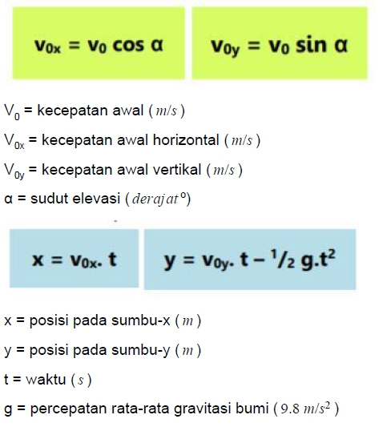
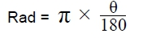

# Soal Tutorial

Suatu hari, Benny mengikuti kepanitiaan BETIS (Bimbingan Belajar Gratis) di Fasilkom UI
menjadi seorang pengajar. Benny mendapatkan bagian mengajar Fisika. Pada suatu
pertemuan, Benny mengajarkan mengenai materi gerak parabola. Seorang murid lalu
memberikan soal kepada Benny untuk dikerjakan.

Soal yang diberikan berbunyi seperti ini: Sebuah bola dilempar dengan kecepatan awal V 0
dan sudut kemiringan α. Hitunglah posisi bola tersebut (x, y) setelah t detik berlalu!

Benny masih ingat rumus-rumus yang digunakan untuk soal tersebut, tetapi karena lama
tidak menyentuh Fisika, Benny sudah tidak pandai menghitung persamaan dengan
bilangan-bilangan rumit. Bantulah Benny dengan membuat program yang dapat menghitung
posisi pada waktu tertentu!

### Rumus


\* Konversi derajat ke radian


#### Contoh Input:

<pre>
Kecepatan awal (m/s) : 35.5
Sudut (derajat) : 30
Waktu (s) : 0.5
</pre>

#### Contoh Output

<pre>
Jarak : 15.37 meter
Ketinggian : 7.65 meter
</pre>

#### Batasan:

- Diberikan input kecepatan, waktu, sudut di mana kecepatan, waktu, sudut > 0

- Nilai kecepatan awal yang diberikan dalam m/s, sudut diberikan dalam derajat, dan waktu
  diberikan dalam detik.

- Nilai pada output harus menampilkan 2 digit di belakang koma. Kalian dapat menerapkannya
  dengan menambahkan ```x = float( '%.2f' % x)``` pada kodingan kalian.

#### Catatan:

- Gravitasi ditetapkan menjadi 9.8 m/s2.

- Python menyediakan library khusus untuk operasi rumit di matematika, seperti sinus dan
  cosinus, di library math , kalian bisa menggunakannya dengan menambahkan import math
  pada kodingan kalian. Lalu kalian bisa menggunakan fungsi-fungsi yang tersedia. Contoh untuk
  mencari nilai sinus, kalian bisa menggunakannya dengan menambahkan ```math.sin(x)```.
  Namun perlu diingat bahwa parameter x harus dalam satuan radian.

- Dokumentasi resmi python tentang modul math : https://docs.python.org/3/library/math.html

<br>

**ALD DHA GIL DST**

---

Diambil dari `Lab 2 Senin.pdf` (Tutorial Lab 2 DDP1 C --
4 September 2017)
