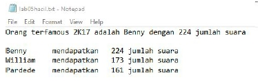

# Soal Tutorial

## Benny’s Famous Contest

Suatu hari, Benny , William, dan Pardede mengadakan kompetisi untuk menentukan
siapa yang paling tampan dan menarik di Fasilkom. Akhirnya mereka mengadakan
voting ke seluruh elemen Fasilkom.

Ketika hasil voting telah diterima, ternyata file penampung hasil voting
menjadi berantakan dikarenakan compatibility issue . Sehingga pemenang kontes
tersebut sulit ditentukan.

Akhirnya Benny meminta tolong kepada kalian mahasiswa Fasilkom UI yang jago
programming, baik dan gemar untuk menyapa elemen fasilkom, rajin mengerjakan
tugas PMB, dan aktif sebagai angkatan, untuk membuat program untuk menghitung
jumlah vote dari file yang error tadi.

**Tugas :**

Membaca isi file, lalu membaca tiap-tiap kata yang ada di dalamnya, jika kata
yang bersangkutan sama dengan nama seseorang diatas (Benny, William, atau
Pardede), maka vote orang terkait bertambah satu.

#### Format masukan :

masukkan berupa 2 input, yaitu nama file yang akan diproses, dan nama file
keluaran (beserta **formatnya**), contoh :

```
Nama file masukkan : lab05input.txt
Nama file keluaran : lab05hasil.txt
>>>
```

#### Format keluaran :

Output berupa file dengan nama file sesuai yang diberi user saat meminta input,
adapun contoh isi dari file tersebut :


#### Keterangan :

- Dikarenakan file nya corrupt , maka isi dari file nya terdapat tanda titik
  { . } yang berantakan, oleh karena itu sebelum melakukan proses perhitungan,
  hilangkan terlebih dahulu titik-titik yang mengganggu tersebut.

- Isi teks dari output harus menggunakan formatting agar terlihat rapi (lihat
  contoh isi teks diatas)

- Pengecekan harus bersifat case insensitive , “Benny” dan “bEnnY” merupakan
  vote yang sama dan sah. Silakan bereksperimen dahulu mencari caranya lalu
  diimplementasikan.

- File input akan disediakan di SCELE, pastikan file input dan program kalian
  berada di satu folder yang sama agar tidak terjadi error saat opening file.

- Asumsikan input nama file akan selalu sukses (tidak ada error file not found
  dsb.) jadi tidak perlu melakukan pengecekan ketersediaan file.

## Bonus

- Karena Benny penasaran mengenai siapa pemenangnya, kalian bisa melakukan
  pencarian orang yang memiliki votingan terbanyak, lalu memasukkan hasilnya ke
  file output, contohnya:

  

- Jika ada > 1 orang dengan vote terbanyak, maka cukup salah satu saja yang
  menang (contoh kasus : jumlah vote sama)

### Penilaian

- 85 % - Kebenaran Program
- 10 % - Kerapihan
- 5 % - Dokumentasi
- 10 % - Bonus

<br>

**FDL IF PDD SAT**

---

Diambil dari `Soal Tutorial Lab 5 - Kelas C.pdf` (Tutorial Lab 5 DDP1 C
\-- 25 September 2017)
