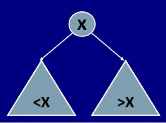
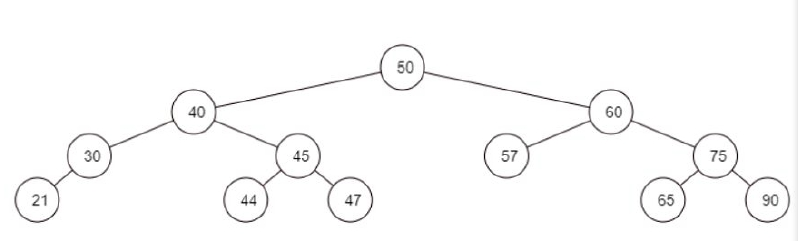

# Soal Tutorial

## Benny-ry* Search Tree
*no pun intended

Di dalam pemrograman, terdapat struktur data yang bernama Binary Search Tree. Binary
Search Tree adalah sebuah tree dimana setiap node dari tree memiliki maksimal 2 child node,
dan nilai child node di kiri selalu lebih kecil daripada node nya dan child node di kanan selalu
lebih besar daripada node nya. Ilustrasinya seperti gambar di bawah ini, terdapat node bernilai
x, maka sebelah kirinya pasti memiliki nilai lebih kecil daripada x, dan sebelah kanannya pasti
memiliki nilai lebih besar daripada x.

  
Gambar 1 : Ilustrasi

Suatu hari, Benny sedang belajar untuk membuat program Binary Search Tree generator. Tentu
saja, pada awalnya Benny tidak langsung mengerti. Tapi setelah beberapa hari, akhirnya dia
berhasil membuat sebuah program Binary Search Tree yang hampir sempurna. Lalu dia
mencoba untuk memasukkan nilai-nilai ke dalam tree tersebut. Hasilnya seperti ini:

  
Gambar 2 : Binary Search Tree

Pertama, Benny menambahkan 50 ke dalam tree, karena tree masih kosong, maka dijadikan 50
sebagai root. Lalu dia menambahkan 40 ke dalam tree, 40 dibandingkan terhadap nilai 50,
karena lebih kecil maka 40 menjadi left child dari 50. Selanjutnya dia menambahkan nilai 45,
kita lihat 45 lebih kecil dari 50, namun karena 50 sudah punya left child yang bernilai 40, maka
45 dibandingkan lagi dengan 40, karena lebih besar daripada 40, 45 menjadi right child dari 40.
Dan seterusnya.

Namun sangat disayangkan bahwa Benny harus menghadiri rapat terkait krisis BenCoin,
sehingga dia meminta anda untuk melengkapi fungsi untuk mencari sebuah nilai di dalam tree.
Sebagai mahasiswa Tarung yang ambisius, memiliki prioritas tinggi terhadap akademis, dan
jago ngodingnya, anda dapat melatih untuk berpikir secara rekursif pada soal ini.

### Template
Terdapat template yang sudah disediakan. Kalian dapat menggunakannya dan tinggal
mengimplementasikan method find_node untuk mencari apakah nilai yang dicari ada di
dalam tree.  
Hint : Terdapat contoh untuk mengakses node pada program, seperti current_node.left
untuk mengakses left child dari suatu node

### Tips dan Trick
- Setiap rekursi mempunyai base case , coba tentukan base case terlebih dahulu.
- Setiap kasus dalam rekursi pada akhirnya akan mencapai base case, dengan begitu
  coba tentukan sebuah recursive case yang pasti akan mencapai base case.
- Kalau tidak mengerti apa yang harus dilakukan, langsung tanyakan!

#### Uji Kasus
| No  | Kasus
| --- | ------------------------------------------------------------
| #1  | `Masukkan sebuah integer yang ingin dicari di dalam tree: 50`
|     | `50 terdapat dalam tree`
| #2  | `Masukkan sebuah integer yang ingin dicari di dalam tree: 44`
|     | `44 terdapat dalam tree`
| #3  | `Masukkan sebuah integer yang ingin dicari di dalam tree: 10`
|     | `10 tidak ada dalam tree`
| #4  | `Masukkan sebuah integer yang ingin dicari di dalam tree: 90`
|     | `90 terdapat dalam tree`

## Bonus
Kalian dapat mengimplementasikan fungsi tracing, dimana jika kalian mencari sebuah nilai dan
terdapat dalam tree, kalian dapat print node yang telah dilewati oleh program saat menjalankan
method rekursif dari root hingga node yang dicari, dan jika tidak ada dalam tree, kalian tidak
perlu print tracingnya. Perlu diingat bahwa ini hanya bonus yang tidak wajib dikerjakan, namun
disarankan untuk mengerjakannya untuk melatih cara berpikir kalian.

#### Uji Kasus Bonus

| No  | Kasus
| --- | ------------------------------------------------------------
| #1  | `Masukkan sebuah integer yang ingin dicari di dalam tree: 65`
|     | `65 terdapat dalam tree`
|     | `Node yang dilewati : 50 60 75 65`
| #2  | `Masukkan sebuah integer yang ingin dicari di dalam tree: 51`
|     | `51 tidak ada dalam tree`

**JANGAN COBA-COBA(saat ini) UNTUK MENGGUNAKAN CARA ITERATIF
KARENA HANYA AKAN MEMPERSULIT DIRI SENDIRI(coba-coba di luar sesi lab aja ya)**

### Penilaian
- 85% Kebenaran (Program berjalan, kasus uji benar)
- 10% Kerapihan (Penamaan variabel jelas, mudah dibaca)
- 5% Dokumentasi (Comment pada bagian-bagian penting)
- 10% Bonus (Implementasi fitur bonus)

**TIDAK MENGGUNAKAN REKURSI AKAN MENYEBABKAN
PENGURANGAN NILAI YANG SANGAT SIGNIFIKAN**

**“Terdapat dua hal tidak tertulis yang harus dilakukan
sebelum ngoding rekursif, yaitu
Paham dan Percaya” - Sang Bijaksana**

 

**ALD DHA GIL DST**

---

Diambil dari `Soal Tutorial Lab 10 - Kelas C` (Tutorial Lab 10 DDP1 C
-- 20 Oktober 2017)
