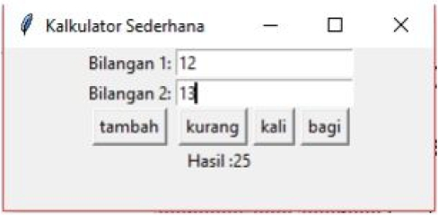

# Soal Tutorial

## Kalkulator Tidak Sederhana

Buatlah sebuah **Graphical User Interface (GUI)** sebuah kalkulator dengan spesifikasi
menerima dua buah angka masukan dari user dan mengeluarkan hasil dari operasi kedua buah
bilangan tersebut. Terdapat **empat buah operasi** yang dapat dilakukan yaitu **tambah**, **kurang**,
**kali**, dan **bagi**. Contoh GUI yang dapat dibuat adalah :

Pada program diatas user diminta untuk memasukkan dua buah bilangan pada inputbox
(Dalam Tkinter, disebut sebagai Entry) dan menekan salah satu dari empat tombol yang
merepresentasikan operasi apa yang akan dilakukan. Setelah tombol ditekan maka operasi
tersebut dilakukan oleh kedua bilangan masukan dan program menampilkan hasil dari operasi
tersebut. Pada contoh di atas operasi yang dilakukan adalah **tambah** sehingga hasilnya adalah
**12 + 13 = 25**.

<b><i>Note: Pikirkan seluruh kemungkinan input</i></b>

Anda dibebaskan untuk merancang GUI yang akan dibuat asalkan memenuhi kriteria yang
disebutkan pada deskripsi soal di atas. *Buatlah asdos Anda kagum dengan karya Anda :)*

### Petunjuk :
- Gunakan objek **StringVar** untuk menyimpan String masukan yang ada di Entry.
- Gunakan parameter **command** yang ada pada objek Button untuk menambahkan method apa
  yang akan dijalankan ketika Button ditekan
- Disediakan template kodingan untuk mengerjakan soal, tidak wajib namun disarankan..
- Gunakan kemampuan googling anda :)

### Link yang dapat membantu jika kalian kebingungan :
- https://stackoverflow.com/
- https://docs.python.org/3/
- Dan pastinya https://www.google.co.id

### Hal yang dapat membantu kalian jika kalian kebingungan :
- Slide Materi di SCELE
- Kemauan
- Usaha
- Doa
- Asdos (setelah melakukan keempat hal di atas)

 

---

Diambil dari `Soal Tutorial Lab 10 - Kelas C` (Tutorial Lab 10 DDP1 C
-- 27 November 2017)
