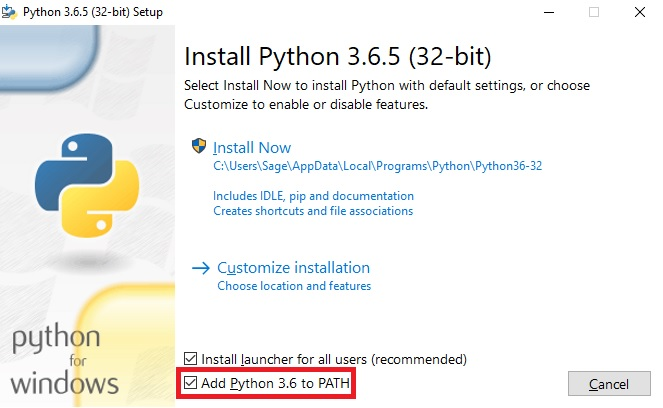
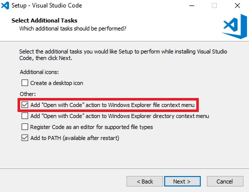
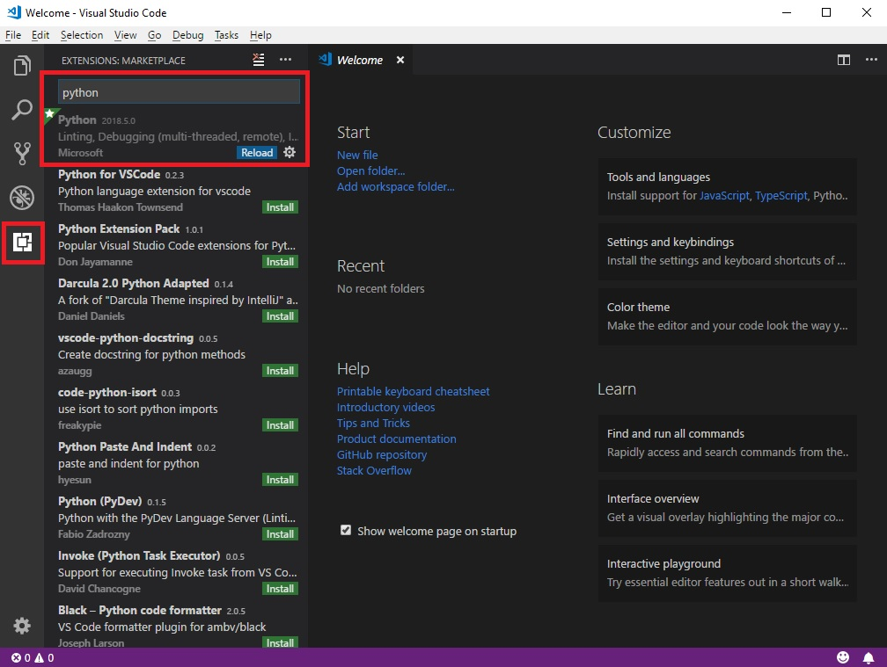
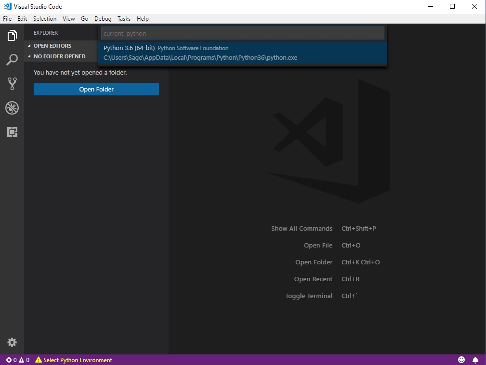
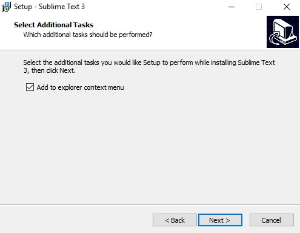

# Tutorial 00: Persiapan

## Daftar Isi

- [Instalasi Python 3](#instalasi-python-3)
- [Instalasi editor teks (opsional)](#instalasi-editor-teks-opsional)
  - [Visual Studio Code](#visual-studio-code)
  - [Sublime Text](#sublime-text)

 

## Instalasi Python 3

Di mata kuliah ini, kalian memerlukan **Python 3**. Silakan ikuti petunjuk
instalasi berikut jika kalian belum menginstalnya di komputer kalian.

1. [Unduh][python3 downloads] Python 3 sesuai sistem operasi yang kalian
   gunakan. Jika menggunakan sistem operasi berbasis Linux, silakan unduh dan
   instal via Terminal.
2. Buka berkas yang telah diunduh. Ketika dialog instalasi muncul, pastikan
   untuk mencentang `Add Python 3.x to PATH` untuk memudahkan kalian nantinya.

   

3. Klik `Install Now`, tunggu hingga selesai, kemudian tutup dialog instalasi.

 

## Instalasi editor teks (opsional)

**Editor teks** bawaan Python (IDLE) sebenarnya sudah cukup untuk membantu
kalian selama mempelajari mata kuliah ini. Namun, ketika sudah mencapai materi
yang lebih lanjut, disarankan untuk menggunakan editor teks lainnya, misalnya
[**Visual Studio Code**][vs code] atau [**Sublime Text**][sublime text].

 

### Visual Studio Code

Apabila kalian ingin menggunakan **Visual Studio Code** sebagai editor teks
kalian, silakan ikuti petunjuk instalasi berikut.

1. [Unduh][vs code download] Visual Studio Code sesuai sistem operasi yang
   kalian gunakan.

2. Buka berkas yang telah diunduh, kemudian lanjutkan proses instalasi.

3. Disarankan untuk mencentang `Add "Open with Code" action` pada tahap
   `Select Additional Tasks`. Ini akan menambahkan opsi `Open with Code` ketika
   kalian melakukan klik kanan pada suatu berkas atau direktori (tergantung
   pilihan yang kalian centang), sehingga kalian bisa mengedit berkas kode di
   Visual Studio Code lebih mudah nantinya.

   

4. Tunggu hingga instalasi selesai, kemudian buka Visual Studio Code.

5. Di bagian kiri, klik ikon untuk `Extensions`, ketikkan `Python` pada
   *search field*, kemudian instal ekstensi Python.

   

6. Jika muncul pesan `Select Python Environment` di bagian bawah, klik dan
   arahkan pada instalasi Python 3 kalian.

   

7. Nantinya, jika muncul notifikasi untuk menginstal `pylint` ketika kalian
   membuka berkas kode Python, silakan instal jika diinginkan. Alat `pylint`
   akan membantu kalian menjaga penulisan kode kalian tetap rapi dan sesuai
   dengan konvensi yang telah ditetapkan.

8. Untuk menjalankan kode Python, klik **`Debug` -> `Start Debugging`**
   atau tekan <kbd>F5</kbd>.

 

### Sublime Text

Apabila kalian ingin menggunakan **Sublime Text** sebagai editor teks kalian,
silakan ikuti petunjuk instalasi berikut.

1. [Unduh][st3 download] Sublime Text sesuai sistem operasi yang kalian
   gunakan.

2. Buka berkas yang telah diunduh, kemudian lanjutkan proses instalasi.

3. Disarankan untuk mencentang `Add to explorer context menu` pada tahap
   `Select Additional Tasks`. Ini akan menambahkan opsi
   `Open with Sublime Text` ketika kalian melakukan klik kanan pada suatu
   berkas, sehingga kalian bisa mengedit berkas kode di Sublime Text lebih
   mudah nantinya.
   

4. Tunggu hingga instalasi selesai, kemudian buka Sublime Text.

5. Klik **`Preferences` -> `Browse Packages...`**, kemudian buka direktori
   `User`.

6. Buka berkas [**`Python (shell).sublime-build`**][sublime build], klik kanan
   pada tombol `Raw`, klik `Save link as...`, arahkan ke direktori `User` tadi,
   kemudian klik `Save`. Bisa juga dengan menyimpannya di direktori sementara,
   kemudian menyalinnya ke direktori `User` tadi.

7. Untuk menjalankan kode Python, tekan
   <kbd>Ctrl</kbd>+<kbd>Shift</kbd>+<kbd>B</kbd>, pilih `Python (shell)`.
   Untuk selanjutnya, cukup tekan <kbd>Ctrl</kbd>+<kbd>B</kbd> saja.

8. Kalian bisa menambahkan beberapa *package* yang berguna melalui
   [**Package Control**][package control], seperti *package* **Anaconda**,
   **SublimeLinter**, **SublimeREPL**, dan lain-lain.

 

[python3 downloads]: https://python.org/downloads

[vs code]: https://code.visualstudio.com

[sublime text]: https://sublimetext.com

[vs code download]: https://code.visualstudio.com/Download

[st3 download]: https://sublimetext.com/3

[sublime build]: misc/Python%20(shell).sublime-build

[package control]: https://packagecontrol.io
