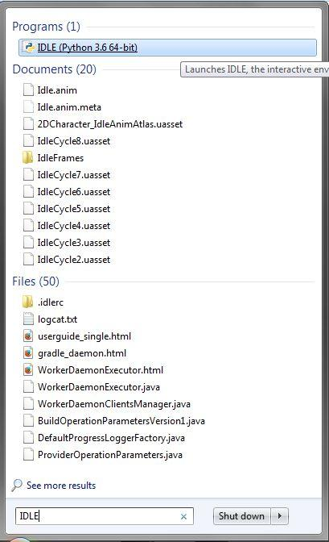
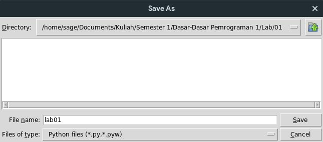
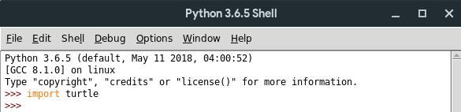
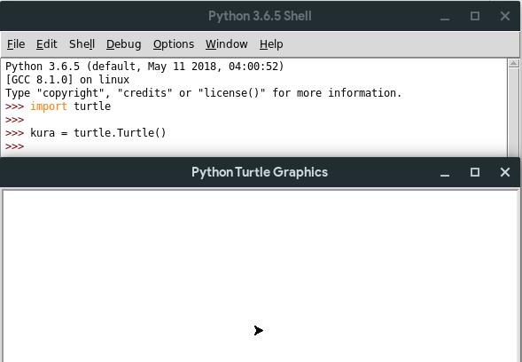
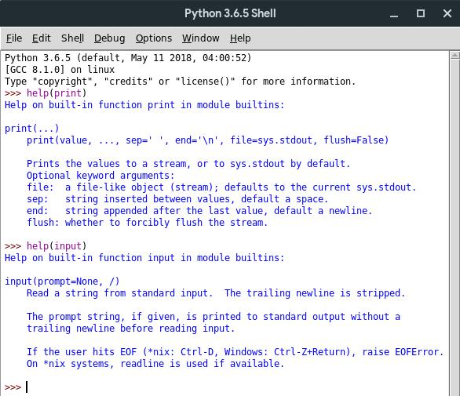

# Tutorial 01: Pengenalan ke IDLE

## Daftar Isi

- [IDLE](#idle)
  - [Membuka IDLE](#membuka-idle)
  - [Membuat *file* kode Python](#membuat-file-kode-python)
  - [Menyimpan *file* program](#menyimpan-file-program)
  - [Menjalankan program](#menjalankan-program)
- [Membuat program sederhana](#membuat-program-sederhana)
  - [Mencetak *(print)*](#mencetak-print)
  - [Meminta masukan *(input)*](#meminta-masukan-input)
- [Menggambar dengan Turtle](#menggambar-dengan-turtle)
  - [*Import module* Turtle](#import-module-turtle)
  - [*Method-method* di objek Turtle](#method-method-di-objek-turtle)
- [Dokumentasi](#dokumentasi)

<br>

## IDLE

[**IDLE**][idle docs] adalah **I**ntegrated **D**evelopment and **L**earning
**E**nvironment milik bahasa [**Python**][python org], bahasa pemrograman yang
akan kita pelajari dalam mata kuliah **Dasar-Dasar Pemrograman 1**. Dalam
tutorial kali ini, kita akan mempelajari bagaimana menggunakan IDLE untuk
membuat program sederhana.

<br>

### Membuka IDLE

**Di Windows**  
Untuk membuka IDLE, cukup klik **Start** dan masukkan `IDLE` pada
*search field*, lalu pilih **IDLE (Python 3.x 64-bit/32-bit)**.



**Di OS berbasis Unix**  
Buka **Terminal**, ketik `idle`, lalu tekan <kbd>Enter</kbd>. Jika sudah ada
*file* `.desktop` untuk IDLE di Desktop Environment kalian, bisa juga mengikuti
langkah yang serupa dengan di Windows.


<br>

Kemudian akan muncul *window* seperti di bawah ini.


Kalian bisa langsung memberi perintah pemrograman di samping tanda `>>>`,
seperti contoh berikut.


<br>

### Membuat *file* kode Python

Untuk membuat ***file*** (berkas) di IDLE, cukup klik **`File`** ->
**`New File`** atau menggunakan *shortcut* <kbd>Ctrl</kbd> + <kbd>N</kbd>,
seperti gambar di bawah.


Kemudian, akan muncul *file* kosong seperti berikut.


Di sini, kalian bisa memberikan instruksi pemrograman sama seperti di IDLE
tadi. **Perbedaannya** adalah program kalian tidak akan langsung dijalankan
saat membuat *file* dan harus dijalankan secara manual (akan dijelaskan nanti).

**Coba kalian masukkan program di bawah ini ke dalam *file* yang kalian buat.**

```python
print("Selamat datang!")
nama = "nama kalian"
print("Selamat Datang di Dasar-Dasar Pemrograman 1", nama)
```

<br>

### Menyimpan *file* program

Untuk menjalankan *file* program, **simpan** terlebih dahulu *file*-nya dengan
**`File` -> `Save`** atau <kbd>Ctrl</kbd> + <kbd>S</kbd>, lalu beri nama
*file*-nya, lalu tekan **`Save`**.



*File* kalian akan tersimpan dan dapat diakses di direktori penyimpanannya.

<br>

### Menjalankan program

Untuk **menjalankan program**, cukup klik **`Run` -> `Run Module`** atau
tekan <kbd>F5</kbd>. Perlu diingat bahwa IDLE tidak akan menjalankan program
jika *file* belum disimpan.

<br>

## Membuat program sederhana

Coba **buat** *file* baru yang berisi kode program berikut, kemudian jalankan.

```python
nama = input("Nama: ")
angkatan = int(input("Tahun Angkatan: "))

print("Hello,", nama, "angkatan", angkatan)
print("Selamat berjuang di Fasilkom!")
```

<br>

### Mencetak *(print)*

```python
print(something)
```

Fungsi `print` adalah perintah yang dapat digunakan untuk **mencetak**
(menampilkan) teks ke dalam layar. Pada dasarnya, hampir semua data bisa
dicetak ke layar menggunakan fungsi `print` ini.

<br>

### Meminta masukan *(input)*

```python
input(insert question text)
```

Ada kalanya kita memerlukan informasi dari luar, misalnya dari **pengguna**
*(user)*. Untuk mendapatkan informasi tersebut, kita bisa menggunakan fungsi
`input`.

<br>

## Menggambar dengan Turtle


*Centrochelys sulcata*

[**Turtle**][turtle docs] adalah sebuah *module* yang sudah *built-in*
(disediakan secara bawaan) di dalam Python yang dapat digunakan untuk
menggambar. Ibaratnya adalah seperti seekor kura-kura yang ditempeli pulpen di
bawahnya, lalu kita beri instruksi apa yang akan dilakukan si kura-kura itu.

<br>

### *Import module* Turtle

Untuk bisa mengakses fitur dari *module* Turtle ini, pertama-tama kita harus
meng-***import*** *module*-nya dengan cara memasukkan kata kunci
`import turtle`.



Untuk bisa menggunakan turtle, kita harus membuat sebuah *instance* dari objek
Turtle dengan cara sebagai berikut.



Maka akan muncul *window* **Python Turtle Graphics** yang akan berfungsi
sebagai kanvas yang digunakan sebagai tempat menggambar.

<br>

### *Method-method* di objek Turtle

Ada beberapa ***method*** (fungsi) yang bisa kalian gunakan untuk
mengoperasikan sebuah objek Turtle yang telah dibuat, seperti:

- `pendown()`  
  *Method* ini digunakan untuk mengaktifkan pena. Ibaratnya, mata pena tersebut
  diarahkan ke bawah hingga menyentuh kanvas sehingga bisa dipakai untuk
  menggambar.

- `penup()`  
  *Method* ini digunakan untuk menonaktifkan pena. Ibaratnya, mata pena
  diangkat dari kanvas sehingga kita bisa memindahkan objek Turtle ke koordinat
  lain tanpa meninggalkan coretan atau jejak di kanvas.

- `forward(x)`  
  *Method* ini digunakan untuk menggerakkan objek Turtle ke depan sejauh `x`
  pixel dan meninggalkan jejak berupa garis **jika** pena diaktifkan
  (`pendown()`).

- `left(x)` dan `right(x)`  
  *Method* ini digunakan untuk mengubah haluan dari objek Turtle sejauh `x`
  derajat ke kiri (`left(x)`) atau ke kanan (`right(x)`).

- `color("color")`  
  *Method* ini digunakan untuk mengubah warna garis yang ditarik pada kanvas.
  Ada belasan pilihan warna yang tersedia secara bawaan, seperti `"red"`,
  `"green"`, `"blue"`, `"yellow"`, `"brown"`, `"violet"`, `"purple"`,
  `"white"`, `"black"`, dan `"gray"`. Silakan tebak sisa warna yang tersedia.

Untuk menggunakan *method-method* di atas, kalian harus memanggilnya dari
objek Turtle yang sudah kalian buat.  
**Coba kalian praktekkan penggunaan *method-method* di atas dengan memasukkan**
**perintah-perintah berikut.**

```python
kura.pendown()
kura.forward(50)
kura.left(45)
kura.forward(100)
kura.penup()
kura.forward(50)
```

Masih banyak *method-method* yang dapat digunakan dalam Turtle. Kalian dapat
melihat *method-method* tersebut dengan mengetik `help(turtle)` atau dengan
membaca dokumentasi Python.

<br>

## Dokumentasi

Ada kalanya kita kebingungan mengenai kegunaan fungsi X, Y, dsb. Python sendiri
sudah menyediakan **dokumentasi** mengenai segala sesuatu mengenai Python.
Dokumentasinya dapat kalian akses dengan mengklik **Help** ->
[**Python Docs**][python docs].


Atau, kalian juga bisa menggunakan fungsi `help(parameter)` di mana
`parameter`nya merupakan fungsi atau objek yang ingin kalian cari tahu.



Atau, kalian juga bisa mencarinya di [**Google**][google] atau
[**StackOverflow**][stackoverflow] seperti orang-orang pada umumnya :)

<br>

---

Diadaptasi dari `lab01_ddp1_rev3.pdf` buatan **IF**, **SAT**, **KF**, dan
**PDD** dengan beberapa perubahan.

[idle docs]: https://docs.python.org/3/library/idle.html

[python org]: https://python.org

[turtle docs]: https://docs.python.org/3/library/turtle.html

[python docs]: https://docs.python.org

[google]: https://google.com

[stackoverflow]: https://stackoverflow.com
