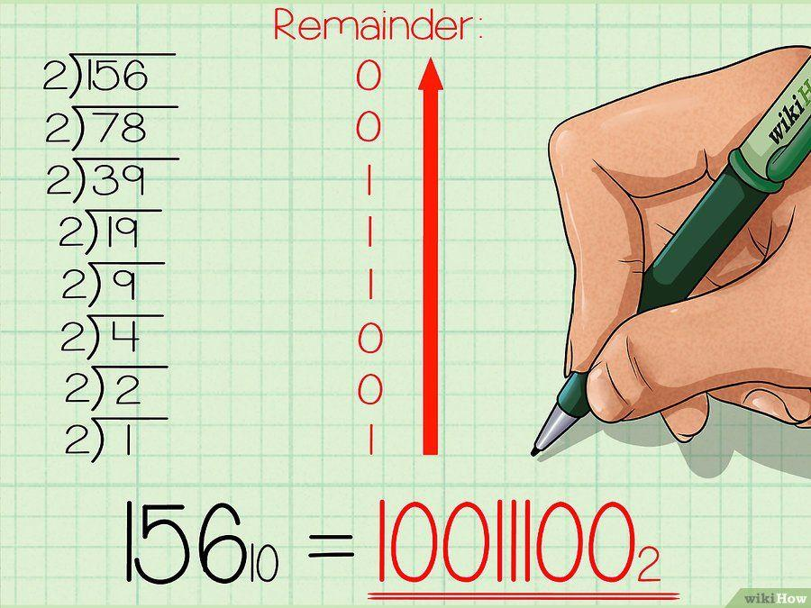

# Tutorial 03: Sistem Bilangan, Percabangan, dan Perulangan

## Daftar Isi

- [Sistem bilangan](#sistem-bilangan)
  - [Desimal dan biner](#desimal-dan-biner)
  - [Konversi biner ke desimal](#konversi-biner-ke-desimal)
  - [Konversi desimal ke biner](#konversi-desimal-ke-biner)
- [Percabangan](#percabangan)
  - [`if`](#if)
  - [`elif`](#elif)
  - [`else`](#else)
- [Perulangan](#perulangan)
  - [`while`](#while)
  - [`for`](#for)
  - [`continue`, `break`, dan `else` di *loop*](#continue-break-dan-else-di-loop)
    - [`continue`](#continue)
    - [`break`](#break)
    - [`else` di *loop*](#else-di-loop)

<br>

## Sistem bilangan

Sumber: [eecs.wsu.edu][number systems]

### Desimal dan biner

Umumnya, kita menggunakan **sistem bilangan** dalam basis 10 (**desimal**)
dalam menyatakan bilangan dalam berbagai hal di kehidupan sehari-hari. Saat
kita menggunakan sistem bilangan basis 10, kita mengenal 10 angka, yaitu 0, 1,
2, 3, 4, 5, 6, 7, 8, dan 9. Dalam sistem bilangan basis 10, setiap digit dikali
10<sup>n</sup> di mana n adalah bilangan sesuai posisi digit tersebut,
dimulai dari 0 dari kanan.

Contohnya:  
843<sub>10</sub>  
= (8 x 10<sup>2</sup>) + (4 x 10<sup>1</sup>) + (3 x 10<sup>0</sup>)  
= (8 x 100) + (4 x 10) + (3 x 1)  
= 800 + 40 + 3

Pada sistem bilangan basis 2 (**biner**), kita hanya mengenal 2 angka, yaitu
0 dan 1. Seperti dalam sistem bilangan basis 10, setiap digit kita kali dengan
basis sistem bilangan yang digunakan, dengan pangkat yang sesuai dengan posisi
digit. Untuk lebih jelasnya, lihat konversi bilangan dari sistem biner ke
sistem desimal berikut.

<br>

### Konversi biner ke desimal

**Konversi bilangan biner ke desimal** cukup sederhana. Caranya dilakukan
dengan mengalikan setiap digit dengan 2<sup>n</sup>, di mana n adalah bilangan
sesuai posisi digit tersebut, dimulai dari 0 dari kanan.

Contoh: konversi 10110<sub>2</sub> ke bentuk desimal.

```
1  0  1  1  0
 \  \  \  \  \________0 x 2^0 =  0
  \  \  \  \__________1 x 2^1 =  2
   \  \  \____________1 x 2^2 =  4
    \  \______________0 x 2^3 =  0
     \________________1 x 2^4 = 16
                                __+
                                22
```

Jadi, 10110<sub>2</sub> `==` 22<sub>10</sub>.

<br>

### Konversi desimal ke biner

**Konversi desimal ke biner** dapat dilakukan dengan membagi bilangan desimal
berulang kali dan menyimpan hasil operasi modulo dengan 2 pada hasil pembagian
tersebut hingga hasil pembagian mencapai nol. Lalu, mengurutkan secara terbalik
hasil modulo dari bilangan-bilangan tersebut. Ilustrasinya seperti berikut.



Sumber: [WikiHow][wikihow]

<br>

## Percabangan

**Percabangan** adalah salah satu bentuk kontrol dalam pemrograman. Dengan
percabangan, kita dapat mengontrol alur program sehingga bagian tertentu dari
program hanya akan dijalankan ketika suatu kondisi terpenuhi. Dalam Python,
percabangan dapat dilakukan dengan menggunakan *keyword* `if`, `elif`, dan
`else`.

Berikut adalah sekilas contoh dari percabangan.

```python
umur = 17
if (umur < 10):
    print("Anak-anak")
elif (umur < 17):
    print("Remaja")
elif (umur < 20):
    print("Remaja-Dewasa")
elif (umur < 50):
    print("Dewasa")
else:
    print("Lansia")

# Output: Remaja-Dewasa
```

<br>

### `if`

**`if`** merupakan penanda awal dari suatu percabangan, oleh karena itu `if`
**wajib** ada dalam setiap percabangan. Seluruh perintah di dalam blok `if`
akan dijalankan ketika kondisi untuk `if` tersebut bernilai `True`.

Contoh:

```python
a = 5
b = 10
if (a < b):
    a += b

# Nilai a menjadi 15 karena kondisi a < b bernilai True
```

<br>

### `elif`

**`elif`** merupakan gabungan dari `else` dan `if`. Seluruh perintah dalam
suatu blok `elif` akan dijalankan ketika kondisi `if` atau `elif` sebelumnya
tidak terpenuhi dan kondisi untuk `elif` tersebut bernilai `True`.

Contoh:

```python
a = 12
b = 10
if a < b:
    a += b
elif a > b:
    a *= 3

# Nilai a menjadi 36 karena a < b bernilai False dan a > b bernilai True
```

<br>

### `else`

Ketika semua kondisi `if` dan `elif` tidak terpenuhi, maka seluruh perintah
dalam blok **`else`** akan berjalan. Bisa dikatakan bahwa `else` adalah solusi
terakhir, sehingga `else` tidak membutuhkan syarat seperti `if` dan `elif`.

Contoh:

```python
a = 10
b = 10
if a < b:
    a += b
elif a > b:
    a *= 3
else:
    a *= b

# Nilai a menjadi 100 karena seluruh kondisi if dan elif tidak terpenuhi
```

<br>

Kalian bisa membuat percabangan di dalam percabangan yang lain *(nested)*,
contohnya seperti berikut.

```python
umur = 17

if (umur < 10):                        # Percabangan utama
    print("Anak-anak")                 #
elif (umur < 21):                      # Percabangan utama
    if (umur < 15):                    #     Percabangan dalam (1)
        print("ABG")                   #
    elif (umur < 18):                  #     Percabangan dalam (1)
        print("Remaja")                #
    else:                              #     Percabangan dalam (1)
        if (umur < 20):                #         Percabangan dalam (2)
            print("Dewasa Muda")       #
        else:                          #         Percabangan dalam (2)
            print("Kepala Dua")        #
elif (umur < 50):                      # Percabangan utama
    print("Dewasa")                    #
else:                                  # Percabangan utama
    print("Lansia")                    #
```

Berhati-hatilah dalam membuat percabangan di dalam percabangan, karena
strukturnya lebih sulit dibaca dan dipahami. Teruslah berlatih agar terbiasa.

<br>

## Perulangan

**Perulangan *(loop)*** adalah salah satu bentuk kontrol yang sering digunakan
dalam pemrograman. Perulangan memungkinkan kita **mengulang** eksekusi
sekumpulan perintah selama suatu kondisi terpenuhi. Dalam Python, terdapat
dua macam perintah utama untuk melakukan perulangan, yaitu `while` dan `for`.

<br>

### `while`

Berikut adalah contoh kode perulangan dengan **`while`**.

```python
num = 0

while (num < 10):
    print(num, end=" ")
    num += 1  # Penting, agar tidak terjadi infinite loop
```

Output:

```
0 1 2 3 4 5 6 7 8 9
```

Dalam membuat `while` *loop*, pastikan *loop*-nya akan berhenti suatu saat
dengan membuat kondisinya menjadi `False`. Lihat contoh, nilai variabel `num`
akan terus bertambah sampai suatu saat di mana `num` bernilai 10, yang mana
akan membuat pengecekan selanjutnya menjadi `False`, dan *loop* berhenti.

<br>

### `for`

Berbeda dengan `while` yang menggunakan kondisi *boolean* secara langsung,
*loop* **`for`** memungkinkan kita melakukan perulangan pada suatu koleksi
(contoh: *list*, *string*, *range*, dsb.). Setiap satu iterasi, satu elemen
dari koleksi tersebut diproses di dalam blok `for`. Perulangan selesai ketika
semua elemen sudah diproses. Jika koleksi memang kosong dari awal, maka
perintah-perintah dalam blok `for` tidak dijalankan, sama seperti jika kondisi
pada `while` sudah bernilai `False` sejak awal.

Berikut adalah contoh kode perulangan dengan `for`.

```python
for num in range(1, 11):
    print(num, end=" ")
print()

for angka in range(0, 11, 2):
    print(angka, end=" ")
print()

# for loop juga bisa digunakan untuk mengiterasi suatu koleksi, misalnya string
# (string merupakan koleksi karakter)

sebuah_string = "Halo, dunia!"
for setiap_karakter in sebuah_string:
    print(setiap_karakter, end=" ")
```

Output:

```
1 2 3 4 5 6 7 8 9 10
0 2 4 6 8 10
H a l o ,   d u n i a !
```

<br>

### `continue`, `break`, dan `else` di *loop*

Di dalam *loop*, ada fitur kontrol tambahan, yaitu **`continue`**, **`break`**,
dan **`else`**.

#### `continue`

Perintah **`continue`**, jika dieksekusi di dalam sebuah *loop* akan membuat
kontrol langsung lompat kembali ke awal *loop* dan kembali mengevaluasi kondisi
*loop*. Seluruh perintah di bawah perintah `continue` yang ada di dalam *loop*
tersebut akan dilompati (tidak dijalankan) dalam iterasi itu. Contoh:

```python
minuman = "susu soda"

for huruf in minuman:
    if huruf == 's':
        continue
    print(huruf, end='')
```

Output:

```
uu oda
```

#### `break`

Perintah **`break`** jika dieksekusi di dalam sebuah *loop*, akan membuat
kontrol keluar dari *loop* yang langsung melingkupi perintah `break` tersebut.
Jika `break` dieksekusi, maka seluruh perintah di bawah perintah `break` yang
ada di dalam *loop* tersebut akan dilompati, begitu juga perintah-perintah di
dalam blok `else` milik *loop* tersebut (jika ada). Contoh:

```python
for angka in range(10):
    if (angka == 5):
        break
    print(angka, "deadline")
print("tepar!")
```

Output:

```
0 deadline
1 deadline
2 deadline
4 deadline
tepar!
```

#### `else` di *loop*

Sebuah *loop* bisa dilengkapi dengan **`else`**. Blok `else` akan dijalankan
jika perulangan selesai secara normal. Sebuah *loop* dikatakan selesai secara
**tidak** normal jika selesai karena perintah `break`. Contoh:

Sumber: [dokumentasi Python][else loop]

```python
for n in range(2, 10):
    for x in range(2, n):
        if n % x == 0:
            print(n, 'equals', x, '*', n//x)
            break
    else:
        # loop fell through without finding a factor
        print(n, 'is a prime number')
```

Output:

```
2 is a prime number
3 is a prime number
4 equals 2 * 2
5 is a prime number
6 equals 2 * 3
7 is a prime number
8 equals 2 * 4
9 equals 3 * 3
```

<br>

---

Diadaptasi dari:

- `lab03_senin.pdf` buatan **FDL**, **IF**, **PDD**, dan **SAT**
- `Lab02 Dasar-Dasar Pemrograman 1 Jumat.pdf`
  buatan **NN**, **WP**, **YE**, dan **AH**
- `ddp1-17gasal-04.pdf` buatan **Adila Alfa Krisnadhi, Ph.D.**

dengan beberapa perubahan.

[number systems]: https://www.eecs.wsu.edu/~ee314/handouts/numsys.pdf

[wikihow]: https://www.wikihow.com/Convert-from-Decimal-to-Binary

[else loop]: http://bit.ly/2sA9S8Z
