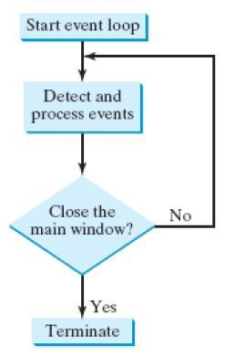
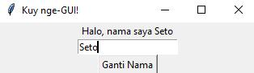
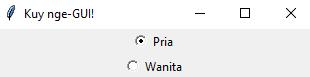
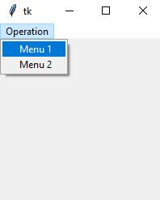
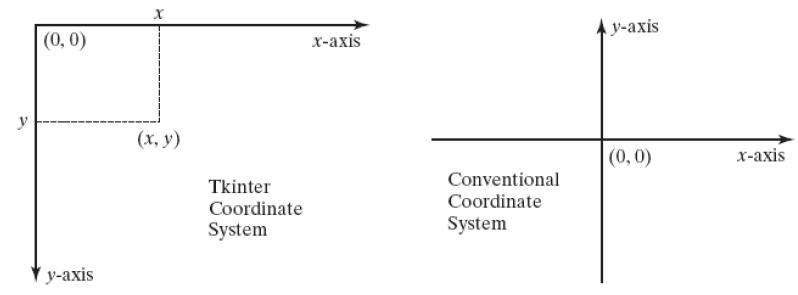
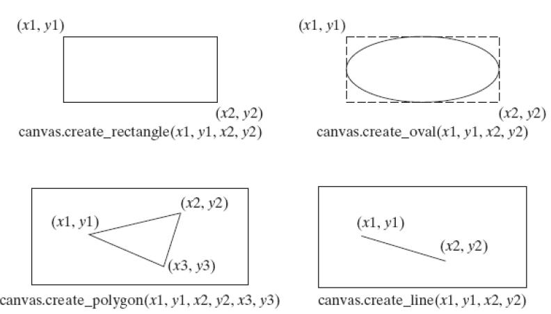
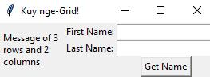

# Tutorial 11: Graphical User Interface (GUI)

## Daftar Isi

- [Definisi GUI](#definisi-gui)
- [`tkinter`](#tkinter)
- [*Event processing*](#event-processing)
- [Mengubah atribut suatu *widget*](#mengubah-atribut-suatu-widget)
- [Berbagai *widget* `tkinter`](#berbagai-widget-tkinter)
- [*Geometry manager*](#geometry-manager)
  - [*Grid manager*](#grid-manager)

<br>

## Definisi GUI

***Graphical User Interface* (GUI)** adalah suatu antarmuka pengguna
*(user interface)* di mana pengguna berinteraksi melalui objek-objek grafis
(yang disebut *widgets*), seperti tombol (*button*), *checkbox*, menu, dsb.
Dalam bahasa Python, kita dapat memanfaatkan *module* `tkinter` untuk membuat
GUI.

<br>

## `tkinter`

**`tkinter`** merupakan *module* GUI bawaan Python yang memanfaatkan *toolkit*
GUI [Tk][tk]. `tkinter` bersifat *cross-platform* dan dapat digunakan di
Windows, Linux, maupun macOS. *Module* ini menyediakan berbagai elemen-elemen
GUI *(widgets)* seperti tombol, menu, entri teks *(text field)*, dsb. `tkinter`
juga dapat digunakan untuk menerapkan *event-driven programming*, di mana GUI
akan merespon ke berbagai *event*, misalnya aksi-aksi pengguna GUI seperti
klik, ketik, *scroll*, dsb.

Di dalam *module* `tkinter`, terdapat berbagai *class* yang dapat digunakan
untuk membuat GUI. *Class* `Tk`, misalnya, dapat digunakan untuk membuat
*window* untuk menampung *widgets*.  
Coba jalankan kode berikut, kemudian pahami dan modifikasi sesuka hati kalian.

```python
import tkinter as tk

class MyFirstGUI:
    def __init__(self, master):
        self.master = master
        self.master.title("Kuy nge-GUI!")

        self.master.title("Kuy nge-GUI!")  # Mengubah judul window
        self.master.geometry("500x100")  # lebar: 500, tinggi: 100

        # Label adalah salah satu widget di tkinter
        # Argumen pertama pada widget constructor selalu parent container
        self.label = tk.Label(master, text="Contoh GUI Python")
        self.label.pack()  # Tempatkan labelnya di container

        self.greet_button = tk.Button(master, text="Sapa", command=self.sapa,
                                      fg="green")
        self.greet_button.pack()

        self.close_button = tk.Button(master, text="Keluar",
                                      command=master.destroy,
                                      bg="red", fg="white")
        self.close_button.pack()

    def sapa(self):
        print("Halo!")


root = tk.Tk()  # Membuat window
my_gui = MyFirstGUI(root)
root.mainloop() # Menjalankan event loop-nya tkinter
```

<br>

## *Event processing*

GUI `tkinter` bersifat *event-driven*, yang berarti akan merespon terhadap
*event*, pada umumnya berupa aksi pengguna. Hal ini dispesifikasikan dalam
*method* `mainloop()`. *Method* `mainloop()` membuat suatu *event loop*, yang
akan memproses berbagai *event* terus menerus sampai *window*-nya ditutup.

Berikut adalah ilustrasi dari sebuah *event loop*.



Suatu *widget* dapat diberi *event handler* (atau *callback function*) yang
akan dieksekusi apabila suatu event terhadap widget itu terjadi, misalnya pada
saat pengguna melakukan klik pada suatu tombol.

<pre>
self.greet_button = tk.Button(master, text="Sapa", <b><u>command=self.sapa</u></b>)
self.close_button = tk.Button(master, text="Keluar", <b><u>command=master.destroy</u></b>)
</pre>

<br>

## Mengubah atribut suatu *widget*

Ketika membuat *(construct)* suatu *widget*, kita bisa memberi spesifikasi
untuk atributnya, seperti `text`, `command`, dsb. Atribut-atribut tersebut
dapat diubah dengan pendekatan ala *dictionary*,
`widget_name["nama_atribut"] = nilai_baru`.  
Perhatikan contoh berikut.

```python
# class MyFirstGUI:
    def sapa(self):
        self.label["text"] = "Halo!"
```

<br>

## Berbagai *widget* `tkinter`

Berikut adalah beberapa *widget* yang tersedia di `tkinter`.

| *Widget*      | Deskripsi                                                                      |
| ------------- | ------------------------------------------------------------------------------ |
| `Button`      | Tombol sederhana, digunakan untuk menjalankan perintah.                        |
| `Canvas`      | Area untuk menampilkan elemen grafis seperti garis, segi empat, atau teks.     |
| `Checkbutton` | *Check box* untuk men-*toggle* antarnilai.                                     |
| `Entry`       | Entri teks, disebut juga *text field* atau *text box*                          |
| `Frame`       | *Container* untuk *widget* lainnya.                                            |
| `Label`       | Menampilkan teks atau gambar.                                                  |
| `Menu`        | Panel menu, untuk mengimplementasikan menu *pull-down* atau *popup*            |
| `Menubutton`  | Tombol menu, untuk mengimplementasikan menu *pull-down*                        |
| `Message`     | Mirip dengan `Label`, tetapi bisa otomatis *wrap* sesuai ukuran tertentu.      |
| `Radiobutton` | Menetapkan nilai variabel ke tombolnya dan mengosongkan `Radiobutton` lainnya. |
| `Text`        | Tampilan teks yang dapat diberi berbagai format.                               |

Berikut adalah ilustrasi untuk sebagian *widget* di atas.

- `Entry`



<br>

- `Radiobutton`



<br>

- `Menu` dan `Menubutton`



<br>

- `Canvas` dan sistem koordinatnya






<br>

## *Geometry manager*

`tkinter` menggunakan ***geometry manager*** untuk mengatur penempatan *widget*
pada suatu *container/window*. Ada beberapa jenis *geometry manager* pada
`tkinter`, seperti *grid manager*, *pack manager*, dan *place manager*.
Tutorial kali ini hanya akan membahas *pack manager* dan *grid manager*.
Pada contoh-contoh sebelumnya, kita sudah menggunakan *pack manager*.

### *Grid manager*

***Grid manager*** menempatkan *widget* pada suatu "tabel". *Widget* dapat
ditempatkan pada *cell* di baris dan kolom tertentu. Kita bisa menggunakan
`rowspan` dan `columnspan` agar suatu *widget* dapat menempati beberapa baris
dan kolom.  
Perhatikan contoh berikut.

```python
import tkinter as tk

class MyGrid:
    def __init__(self, master):
        self.master = master
        master.title("Kuy nge-Grid!")
        message = tk.Message(master, text="Message of 3 rows and 2 columns")
        message.grid(row=1, column=1, rowspan=3, columnspan=2)
        tk.Label(master, text="First Name:").grid(row=1, column=3)
        tk.Entry(master).grid(row=1, column=4)
        tk.Label(master, text="Last Name:").grid(row=2, column=3)
        tk.Entry(master).grid(row=2, column=4)
        tk.Button(master, text="Get Name").grid(row=3, column=4)

root = tk.Tk()
my_grid = MyGrid(root)
root.mainloop()
```

Hasil:



<br>

Untuk mempelajari lebih lanjut tentang GUI menggunakan `tkinter`, silakan buka
[dokumentasinya][gui with tk] dan [referensi ini][tkinter].

<br>

---

Diadaptasi dari:

- `DDP 1 - 14 - GUI_v1.3.pptx` buatan **Fariz Darari, Ph.D.**

dengan beberapa perubahan.

[tk]: https://en.wikipedia.org/wiki/Tk_(software)

[gui with tk]: https://docs.python.org/3/library/tk.html

[tkinter]: https://docs.python.org/3/library/tk.html
